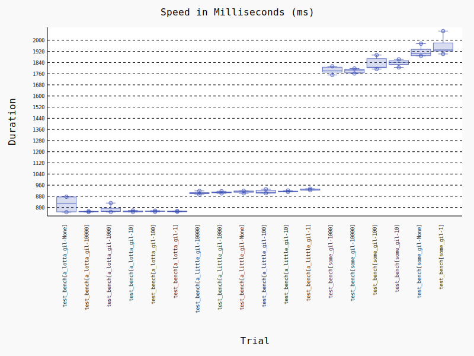

## GIL Knocker


`pip install gilknocker`


[](https://github.com/python/black)
[](https://github.com/milesgranger/gilknocker/actions/workflows/CI.yml)
[](https://pypi.org/project/gilknocker)

[](https://pepy.tech/project/gilknocker)


When you thought the GIL was available, and you find yourself suspecting it might be spending time
with another. 

You probably want [py-spy](https://github.com/benfred/py-spy), however if you're
looking for a quick-and-dirty way to slip in a GIL contention metric within a specific
chunk of code, this might help you.

### How?

Unfortunately, there doesn't appear to be any explicit C-API for checking how busy
the GIL is. [PyGILState_Check](https://docs.python.org/3/c-api/init.html#c.PyGILState_Check) 
won't really work, that's limited to the current thread. 
[PyInterpreterState](https://docs.python.org/3/c-api/init.html#c.PyGILState_Check) 
is an opaque struct, and the [PyRuntimeState](https://github.com/python/cpython/blob/main/Include/internal/pycore_pystate.h)
and other goodies are private in CPython.

So, in ~200 lines of Rusty code, I've conjured up a basic metric that seems 
to align with what is reported by `py-spy` when running the same [test case](./tests/test_knockknock.py).
This works by spawning a thread which, at regular intervals, re-acquires the GIL and checks 
how long it took for the GIL to answer.

Note, the `polling_interval_micros` and `sampling_interval_micros` are configurable. The lower the value, the 
more accurate the metric, but will be more likely to slow your
program down.. because it will play a larger role in competing for the GIL's attention.

### Use

Look at the [tests](./tests)

```python

from gilknocker import KnockKnock

knocker = KnockKnock(polling_interval_micros=1_000, sampling_interval_micros=10_000, timeout_secs=1)
knocker.start()

... smart code here ...

knocker.contention_metric  # float between 0-1 indicating roughly how busy the GIL was.
knocker.reset_contention_metric()  # reset timers and meteric calculation

... some more smart code ...

knocker.stop()
knocker.stop()  # Idempodent stopping behavior

knocker.contention_metric  # will stay the same after `stop()` is called.

knocker.is_running  # If you're ever in doubt

```

### How will this impact my program?

Short answer, it depends, but probably not much. As stated above, the more frequent the 
polling and sampling interval, the more likely non-GIL bound programs will be affected, since there is 
more room for contention. In GIL heavy programs, the monitoring thread will spend most of its 
time simply waiting for a lock. This is demonstrated in the [benchmarks](./benchmarks) testing.

In general, it appears that `polling_interval_micros=1_000` is a good tradeoff in terms of accurate
GIL contention metric and the resulting `sampling_interval_micros=10_000` (defaults to 10x polling interval)
is high enough to relax performance impact a bit.

Below is a summary of benchmarking two different 
functions, one which uses the GIL, and one which releases it. For `interval=None` this means 
no polling was used, effectively just running the function without `gilknocker`. Otherwise, 
the interval represents the value passed to `KnockKnock(polling_interval_micros=interval)`

`python -m pytest -v --benchmark-only benchmarks/ --benchmark-histogram`

```
------------------------------------------------------------------------------------ benchmark: 18 tests -------------------------------------------------------------------------------------
Name (time in s)                       Min               Max              Mean            StdDev            Median               IQR            Outliers     OPS            Rounds  Iterations
----------------------------------------------------------------------------------------------------------------------------------------------------------------------------------------------
test_bench[a_little_gil-100000]     1.5368 (2.07)     1.6596 (2.23)     1.5968 (2.14)     0.0476 (130.12)   1.5943 (2.14)     0.0719 (140.14)        2;0  0.6262 (0.47)          5           1
test_bench[a_little_gil-10000]      1.5321 (2.06)     1.5989 (2.14)     1.5618 (2.09)     0.0289 (78.95)    1.5610 (2.09)     0.0510 (99.52)         2;0  0.6403 (0.48)          5           1
test_bench[a_little_gil-1000]       1.5246 (2.05)     1.5298 (2.05)     1.5271 (2.05)     0.0019 (5.12)     1.5269 (2.05)     0.0021 (4.00)          2;0  0.6549 (0.49)          5           1
test_bench[a_little_gil-100]        1.5505 (2.09)     1.5543 (2.08)     1.5528 (2.08)     0.0014 (3.96)     1.5533 (2.08)     0.0018 (3.60)          2;0  0.6440 (0.48)          5           1
test_bench[a_little_gil-10]         1.5863 (2.13)     1.6074 (2.16)     1.5928 (2.14)     0.0088 (23.94)    1.5896 (2.13)     0.0111 (21.60)         1;0  0.6278 (0.47)          5           1
test_bench[a_little_gil-None]       1.5043 (2.02)     1.5067 (2.02)     1.5051 (2.02)     0.0011 (2.95)     1.5044 (2.02)     0.0016 (3.17)          1;0  0.6644 (0.50)          5           1
test_bench[a_lotta_gil-100000]      0.7450 (1.00)     0.7458 (1.0)      0.7455 (1.0)      0.0004 (1.0)      0.7457 (1.0)      0.0005 (1.0)           1;0  1.3413 (1.0)           5           1
test_bench[a_lotta_gil-10000]       0.7471 (1.00)     0.8104 (1.09)     0.7601 (1.02)     0.0281 (76.94)    0.7472 (1.00)     0.0168 (32.82)         1;1  1.3156 (0.98)          5           1
test_bench[a_lotta_gil-1000]        0.7436 (1.0)      0.7472 (1.00)     0.7463 (1.00)     0.0015 (4.11)     0.7470 (1.00)     0.0013 (2.54)          1;1  1.3400 (1.00)          5           1
test_bench[a_lotta_gil-100]         0.7558 (1.02)     0.7680 (1.03)     0.7640 (1.02)     0.0050 (13.56)    0.7644 (1.03)     0.0061 (11.97)         1;0  1.3089 (0.98)          5           1
test_bench[a_lotta_gil-10]          0.7542 (1.01)     0.7734 (1.04)     0.7649 (1.03)     0.0084 (23.05)    0.7669 (1.03)     0.0151 (29.45)         2;0  1.3074 (0.97)          5           1
test_bench[a_lotta_gil-None]        0.7437 (1.00)     0.8490 (1.14)     0.8006 (1.07)     0.0501 (137.15)   0.8074 (1.08)     0.0969 (189.03)        1;0  1.2490 (0.93)          5           1
test_bench[some_gil-100000]         1.4114 (1.90)     1.4131 (1.89)     1.4122 (1.89)     0.0007 (1.81)     1.4121 (1.89)     0.0010 (2.00)          2;0  0.7081 (0.53)          5           1
test_bench[some_gil-10000]          1.4115 (1.90)     1.4258 (1.91)     1.4167 (1.90)     0.0059 (16.03)    1.4141 (1.90)     0.0083 (16.19)         1;0  0.7058 (0.53)          5           1
test_bench[some_gil-1000]           1.4169 (1.91)     1.5793 (2.12)     1.4618 (1.96)     0.0690 (188.82)   1.4232 (1.91)     0.0769 (150.04)        1;0  0.6841 (0.51)          5           1
test_bench[some_gil-100]            1.4468 (1.95)     1.6261 (2.18)     1.5701 (2.11)     0.0752 (205.83)   1.5998 (2.15)     0.1004 (195.70)        1;0  0.6369 (0.47)          5           1
test_bench[some_gil-10]             1.5269 (2.05)     1.9894 (2.67)     1.7037 (2.29)     0.1895 (518.49)   1.7301 (2.32)     0.2692 (524.96)        1;0  0.5870 (0.44)          5           1
test_bench[some_gil-None]           1.4115 (1.90)     1.4267 (1.91)     1.4155 (1.90)     0.0063 (17.33)    1.4136 (1.90)     0.0053 (10.24)         1;1  0.7065 (0.53)          5           1
----------------------------------------------------------------------------------------------------------------------------------------------------------------------------------------------
```



---

### License

[Unlicense](LICENSE) or [MIT](LICENSE-MIT), at your discretion.
